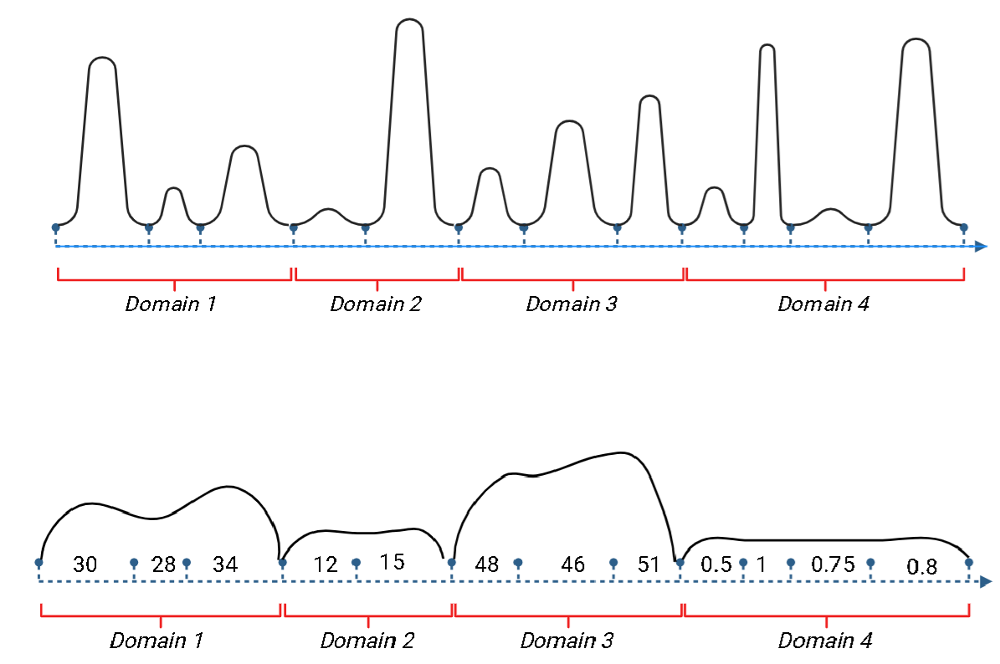
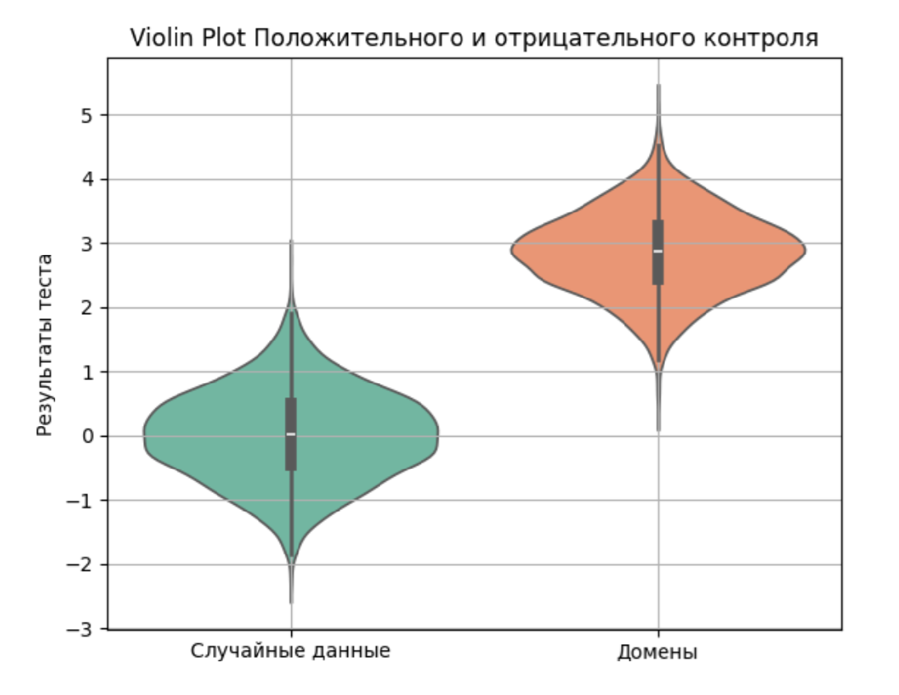
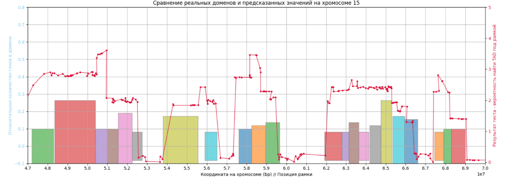

# GeneRotor — Detection of Coordinated Gene Expression Domains

This repository contains **GeneRotor**, a universal and statistically sound method for identifying regions of **coordinated gene expression**, which can serve as indicators of domain structures or other functional regulatory modules.  

The tool was designed to be lightweight, scalable, and easy to apply to genome-wide datasets.  

## Project Goals
The main objectives of this work were:  
- Development of a **statistical test** to assess the level of coordinated expression within a chromosomal region.  
- Creation of a **quality control system**: positive and negative controls, sensitivity and specificity checks, noise modeling.  
- **Optimization for large datasets**, scalable to entire chromosomes and all samples.  
- Adaptation to different interpretations of gene “membership” in a domain (start, end, center, proportional to length).  
- Construction of an **inverse problem algorithm** — predicting potential domains from expression maps without structural data.  
- Laying the groundwork for a **public online tool**, enabling researchers to upload their data and obtain results.  

---

## How to Run
Example command-line usage:  

```bash
python3 GeneRotor.py analyze --type genome-wide --iterations 500 --gene_input "path/to/gene_file" --domain_input "path/to/domain_file" --output "path/to/output_folder" --mapper_method proportional

```
## Visual Examples
Random vs. Coordinated Domains
Illustration of how random and non-random domains can appear within a single chromosomal region:



## Violin Plot of Results
How the program outputs results considering noise and correlation of gene expression:


## Sliding Window Predictions
Using a sliding-window approach, the program predicts where domain structures are likely located on the chromosome:


## Key Features

- Genome-wide analysis of coordinated expression
- Configurable statistical parameters and iteration counts
- Scalable to large datasets
- Output in user-friendly formats with visualization-ready data

## Requirements

- Python 3.10+
- NumPy, SciPy, Pandas, Matplotlib, Seaborn (for visualization)
- Standard Python libraries (abc, typing, dataclasses)

## Notes

This project forms the basis for both research applications and potential deployment as an interactive online tool, where researchers can input their data and explore domain predictions.
